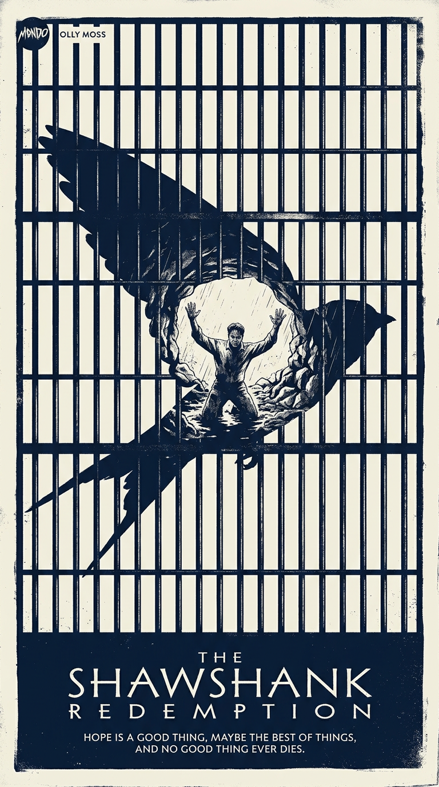
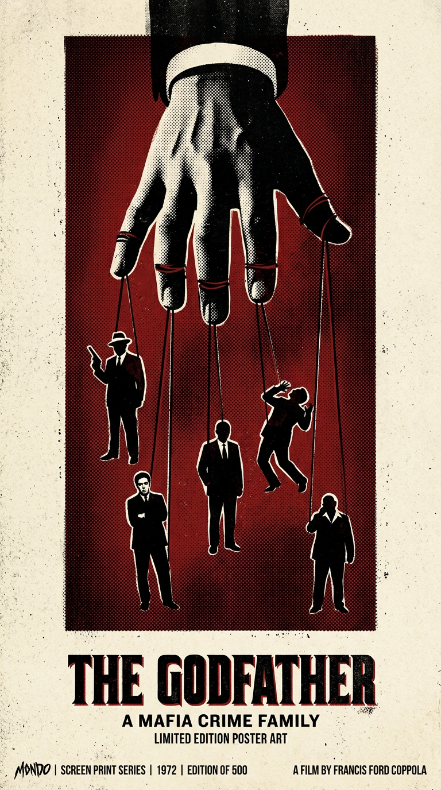
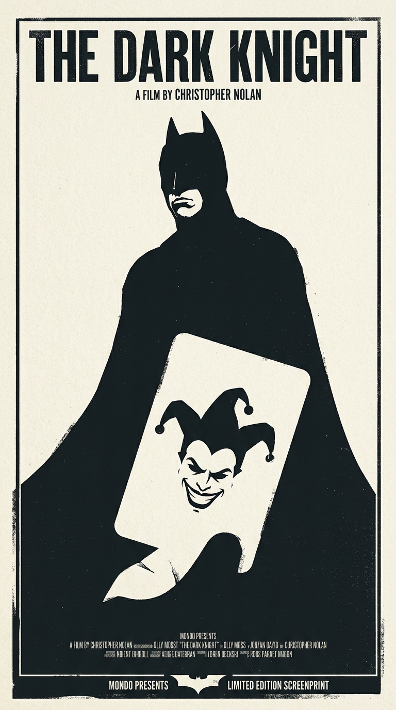
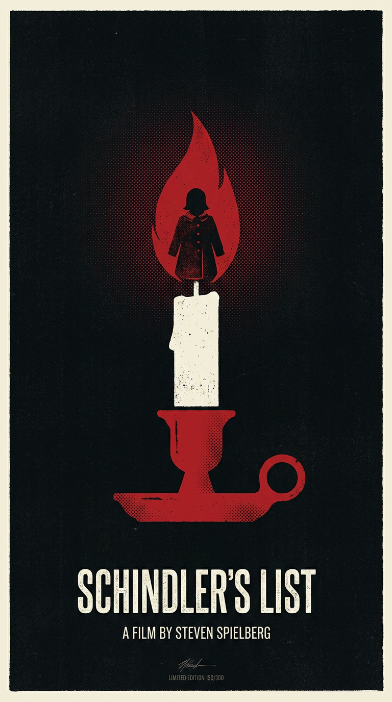
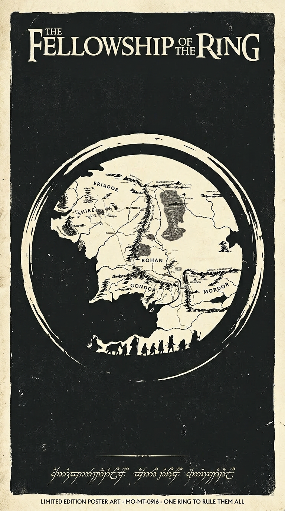

# mondo-poster-prompt

[English](README.md) | 简体中文

使用Mondo标志性的丝网印刷风格生成AI图像提示词和设计作品 - 大胆配色、极简构图、象征性意象。

## 🚀 v2.0 新特性！

✨ **20位艺术家风格** - 从Saul Bass到Toulouse-Lautrec
🤖 **AI提示词优化** - 在尊重你原意的基础上增强
🎨 **三栏风格对比** - 并排生成多个选项
🖼️ **图生图转换** - 将现有海报转为Mondo风格
🎨 **智能配色** - AI建议，你可覆盖

## 安装

```bash
npx skills add joeseesun/mondo-poster-prompt
```

## 快速开始

### 方式1：通过Claude Code交互使用（推荐）

直接对Claude说：
```
"用Mondo风格为《银翼杀手》生成海报，对比几个风格"
"为《1984》设计书籍封面，Saul Bass风格"
"生成爵士音乐节海报，用鲜艳的配色"
```

Claude会自动引导你完成设计！

### 方式2：命令行直接使用

```bash
# 基础生成（9:16竖版）
python3 ~/.claude/skills/mondo-poster-prompt/scripts/generate_mondo_enhanced.py "阿基拉" movie --style kilian-eng

# AI增强提示词
python3 ~/.claude/skills/mondo-poster-prompt/scripts/generate_mondo_enhanced.py "银翼杀手" movie --ai-enhance

# 三栏风格对比
python3 ~/.claude/skills/mondo-poster-prompt/scripts/generate_mondo_enhanced.py "盗梦空间" movie --compare saul-bass,olly-moss,dan-mccarthy

# 自定义配色
python3 ~/.claude/skills/mondo-poster-prompt/scripts/generate_mondo_enhanced.py "爵士之夜" event --style milton-glaser --colors "迷幻橙色, 紫色, 黄色"

# 图生图转换
python3 ~/.claude/skills/mondo-poster-prompt/scripts/generate_mondo_enhanced.py "黑色电影" movie --input 原海报.jpg --style saul-bass

# 查看所有20种艺术家风格
python3 ~/.claude/skills/mondo-poster-prompt/scripts/generate_mondo_enhanced.py --list-styles
```

## 🎨 20位传奇海报设计艺术家

### 美好年代先驱 (1870s-1900s)
- **jules-cheret** - 现代海报之父，明亮欢快的色彩
- **toulouse-lautrec** - 蒙马特大师，平面色块，日本浮世绘影响
- **alphonse-mucha** - 新艺术运动代表，流动曲线，华丽花卉
- **steinlen** - 社会现实主义，表现性线条，猫咪主题
- **eugène-grasset** - 中世纪哥特式，彩色玻璃美学

### 现代主义大师 (1920s-1960s)
- **saul-bass** - 极简几何抽象，视觉隐喻
- **cassandre** - 立体主义平面，戏剧性透视，装饰艺术
- **milton-glaser** - 迷幻波普艺术，创新字体设计
- **josef-muller-brockmann** - 瑞士网格，数学精确
- **paul-rand** - 趣味几何，聪明的视觉双关

### 电影海报传奇 (1970s-1990s)
- **drew-struzan** - 绘画写实主义，史诗电影构图
- **olly-moss** - 超极简负空间，隐藏意象
- **tyler-stout** - 极繁主义拼贴，精细细节
- **martin-ansin** - 装饰艺术优雅，精致复古
- **laurent-durieux** - 视觉双关，神秘氛围

### 当代创新者 (2000s-Present)
- **kilian-eng** - 几何未来主义，精确技术线条
- **dan-mccarthy** - 超扁平几何抽象
- **jock** - 粗犷表现笔触，动态动作
- **shepard-fairey** - 宣传风格，网点，政治
- **jay-ryan** - 民间手工感，温暖质感
- **paula-scher** - 字体极繁主义，层叠文字

## 📸 实际案例展示

### IMDB Top 10 电影海报系列

我们用不同风格为IMDB评分最高的10部电影设计了Mondo风格海报：

<table>
  <tr>
    <td width="33%">
      <br>
      <b>肖申克的救赎</b><br>
      <i>负空间技巧 - 铁栏中的飞鸟</i>
    </td>
    <td width="33%">
      <br>
      <b>教父</b><br>
      <i>极简主义 - 操控之手</i>
    </td>
    <td width="33%">
      <br>
      <b>黑暗骑士</b><br>
      <i>负空间双关 - 蝙蝠中的小丑</i>
    </td>
  </tr>
  <tr>
    <td width="33%">
      <br>
      <b>教父2</b><br>
      <i>大气分层 - 双时间线</i>
    </td>
    <td width="33%">
      <br>
      <b>十二怒汉</b><br>
      <i>极简几何 - 12只手与刀</i>
    </td>
    <td width="33%">
      <br>
      <b>王者归来</b><br>
      <i>史诗大气 - 火焰中的王冠</i>
    </td>
  </tr>
  <tr>
    <td width="33%">
      <br>
      <b>辛德勒的名单</b><br>
      <i>极简符号 - 烛光中的希望</i>
    </td>
    <td width="33%">
      <br>
      <b>护戒使者</b><br>
      <i>负空间地图 - 戒指中的中土</i>
    </td>
    <td width="33%">
      <br>
      <b>低俗小说</b><br>
      <i>Olly Moss超简 - 公文箱之谜</i>
    </td>
  </tr>
</table>

### 负空间大师级技巧示例


**唐伯虎点秋香**
*形底反转技巧 - 扇子轮廓内的负空间形成女性侧脸剪影*

## ✨ 核心特性

### 1. AI提示词优化（尊重原意）

```bash
python3 scripts/generate_mondo_enhanced.py "银翼杀手" movie --ai-enhance
```

**工作原理：**
- 保留你的核心创意
- AI添加一个完美的符号元素
- 建议2-3个配色（可覆盖）
- 应用负空间技巧
- 保持简洁不杂乱

### 2. 三栏风格对比

```bash
python3 scripts/generate_mondo_enhanced.py "沙丘" movie --compare saul-bass,olly-moss,kilian-eng
```

并排生成3种风格对比，完美用于：
- 探索不同艺术路径
- 客户演示
- 找到最适合的风格

### 3. 图生图转换

```bash
python3 scripts/generate_mondo_enhanced.py "黑色电影" movie --input 海报.jpg --style saul-bass
```

**使用场景：**
- 将摄影海报转为插画风格
- 为现有设计应用Mondo美学
- 重新想象经典海报

### 4. 智能配色系统

```bash
# AI建议配色
python3 scripts/generate_mondo_enhanced.py "爵士音乐节" event --style jules-cheret

# 用户自定义配色
python3 scripts/generate_mondo_enhanced.py "爵士音乐节" event --style jules-cheret --colors "鲜艳黄色, 深蓝, 红色"
```

## 📋 Mondo美学核心原则

Mondo海报的特征：

1. **艺术化重新诠释** - 不是字面的电影场景，而是概念性的视觉提炼
2. **丝网印刷美学** - 有限色板（2-5色），平面色块，半色调纹理
3. **极简主义象征** - 关键道具、剪影、负空间胜过角色面孔
4. **大胆复古字体** - 手绘字体，紧缩无衬线，装饰艺术影响
5. **复古配色** - 高饱和度，复古双色调，大胆对比（橙/青、红/米色等）

## 📐 高级技巧

### 负空间形底反转

Olly Moss大师级技巧 - 负空间（没有油墨的区域）形成有意义的形状：

```bash
python3 scripts/generate_mondo_enhanced.py "星球大战" movie --style olly-moss
```

**经典示例：**
- 达斯·维达剪影内藏AT-ST战斗场景
- 侦探帽中的负空间形成城市天际线
- 刀刃反射出反派剪影

### 戏剧性尺度对比

微小 vs 巨大 = 情感冲击：

```bash
# 人物占底部20%，顶部70%负空间
python3 scripts/generate_mondo_enhanced.py "2001太空漫游" movie --style kilian-eng --colors "深空黑, 月球白"
```

### 单一形状叙事

一个完美符号 = 完整故事：

```bash
python3 scripts/generate_mondo_enhanced.py "大白鲨" movie --style saul-bass --colors "海洋蓝, 日落橙"
```

## 🎯 适用场景

- **电影海报** - 影院、家庭影院、影迷收藏
- **书籍封面** - 小说、非虚构、漫画
- **专辑封面** - 摇滚、爵士、电子音乐
- **活动海报** - 音乐节、展览、放映会
- **品牌设计** - 复古品牌视觉识别
- **社交媒体** - Instagram Stories、TikTok封面（9:16优化）

## 💻 系统要求

- **Python 3.7+**
- **必需依赖**: `requests`
- **可选依赖**: `Pillow` (用于对比模式和图生图)
- **API**: AI Gateway API Key（设置为环境变量 `AI_GATEWAY_API_KEY`）

安装依赖：
```bash
pip install -r requirements.txt
```

## 📚 完整文档

- [SKILL.md](SKILL.md) - 完整使用指南
- [references/artist-styles.md](references/artist-styles.md) - 20位艺术家风格详解
- [references/genre-templates.md](references/genre-templates.md) - 类型模板（恐怖、科幻、西部等）
- [references/composition-patterns.md](references/composition-patterns.md) - 构图模式策略
- [references/book-covers.md](references/book-covers.md) - 书籍封面设计最佳实践

## 🤝 贡献

欢迎提交Issue和Pull Request！如果你创作了很棒的Mondo风格海报，欢迎分享。

## 📄 许可证

MIT License

## 📱 关注作者

如果这个项目对你有帮助，欢迎关注我获取更多技术分享：

- **X (Twitter)**: [@vista8](https://x.com/vista8)
- **微信公众号「向阳乔木推荐看」**:

<p align="center">
  
</p>

---

**由 [Claude Code](https://claude.com/claude-code) 提供支持** 🤖✨
